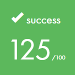

# Codam
All my projects at [Codam Coding College](https://codam.nl). 

Maximum mark for the mandatory part of every assignment is 100%.  
If the mandatory part is excellent it is possible to score up to 25% bonus points. 
If the mandatory part is not flawless the bonuses will be totally ignored. 
The exams contain no bonuses so the maximum absolute score is 100%. 

<table>
	<thead>
		<tr>
			<th><h4>Rank</h4></th>
			<th><h4>Project</h4></th>
			<th><h4>Description</h4></th>
			<th><h4>Mark</h4></th>
			<th><h4>Language</h4></th>
		</tr>
	</thead>
	<tbody>
		<tr>
			<td></td>
			<td><a href=libft/>libft</a></td>
			<td>Library of C functions</td>
			<td></td>
			<td></td>
		</tr>
		<tr>
			<td></td>
			<td><a href=get_next_line/>get_next_line</a></td>
			<td>My implementation of the get_next_line function, similar to the getline from CPP and fgets from C</td>
			<td></td>
			<td></td>
		</tr>
		<tr>
			<td></td>
			<td><a href=born2beroot/>born2beroot</a></td>
			<td>Setting up a server running on Debian implementing strict rules (using VirtualBox)</td>
			<td></td>
			<td></td>
		</tr>
		<tr>
			<td></td>
			<td><a href=ft_printf/>ft_printf</a></td>
			<td>My reimplementation of the printf, the goal is to compile a library containing our our own version of the printf function</td>
			<td></td>
			<td></td>
		</tr>
		<tr>
			<td></td>
			<td><a href=push_swap/>push_swap</a></td>
			<td>This project involves sorting data on a stack, with a limited set of instructions, and the smallest number of moves. To make this happen, you will have to manipulate various sorting algorithms and choose the most appropriate solution(s) for optimized data sorting.</td>
			<td></td>
			<td></td>
		</tr>
		<tr>
			<td></td>
			<td><a href=pipex/>pipex</a></td>
			<td>This project consists of reproducing the behavior of the <a href=https://www.geeksforgeeks.org/piping-in-unix-or-linux/>shell pipe</a>, redirecting STDIN and STDOUT using <a href=https://www.geeksforgeeks.org/pipe-system-call/>pipes</a>.</td>
			<td></td>
			<td></td>
		</tr>
		<tr>
			<td></td>
			<td><a href=fract-ol/>fract-ol</a></td>
			<td>This project is designed to get familiar with the MiniLibX, to discover or use the mathematical notion of complex numbers, to take a peek at the concept of optimization in computer graphics and practice event handling.</td>
			<td></td>
			<td></td>
		</tr>
		<tr>
			<td></td>
			<td><a href=exam_rank_02/>exam_rank_02</a></td>
			<td>In two hours time we have to complete two assignments (without an internet connection). The first one is <a href=exam_rank_02/inter/>inter</a> or <a href=exam_rank_02/union/>union</a>. The second one is either <a href=exam_rank_02/ft_printf/>ft_printf</a> or <a href=exam_rank_02/get_next_line/>get_next_line</a>.</td>
			<td></td>
			<td></td>
		</tr>
		<tr>
			<td></td>
			<td><a href=philosophers/>philosophers</a></td>
			<td>In computer science, The Dining Philosopher Problem is an example problem often used in concurrent algorithm design to illustrate synchronization issues and techniques for resolving them.</td>
			<td></td>
			<td></td>
		</tr>
		<tr>
			<td></td>
			<td><a href=minishell/>minishell</a></td>
			<td>The objective of this project is to create a simple shell</td>
			<td></td>
			<td></td>
		</tr>
		<tr>
			<td></td>
			<td><a href=exam_rank_03/>exam_rank_03</a></td>
			<td>In two hours time we have to complete two assignments (without an internet connection). The first one is <a href=exam_rank_03/ft_split.c>ft_split</a> and the second one is a <a href=exam_rank_03/sorting_linked_list.c>linked list sorting algorithm</a>.</td>
			<td></td>
			<td></td>
		</tr>
		<tr>
			<td></td>
			<td><a href=cpp/>c++ modules</a></td>
			<td>The C++ modules is designed to help understand the specifities of the language when compared to C and object-oriented programming.</td>
			<td></td>
			<td></td>
		</tr>
		<tr>
			<td></td>
			<td><a href=net_practice/>net_practice</a></td>
			<td>This project is a general practical exercise to let you discover networking.</td>
			<td></td>
			<td></td>
		</tr>
		<tr>
			<td></td>
			<td><a href=mini_rt/>mini_rt</a></td>
			<td>We had to create a ray tracer from scratch.</td>
			<td></td>
			<td></td>
		</tr>
		<tr>
			<td></td>
			<td><a href=exam_rank_04/>exam_rank_04</a></td>
			<td>In two hours time (without an internet connection) we had to write a program that behaves like executing a shell command</td>
			<td></td>
			<td></td>
		</tr>
		<tr>
			<td></td>
			<td><a href=inception/>inception</a></td>
			<td>Scalable and stable infrastructure using Docker and Docker Compose.</td>
			<td>WIP</td>
			<td></td>
		</tr>
		<tr>
			<td></td>
			<td><a href=WIP/>webserv</a></td>
			<td></td>
			<td>WIP</td>
			<td></td>
		</tr>
		<tr>
			<td></td>
			<td><a href=exam_rank_05/>exam_rank_05</a></td>
			<td></td>
			<td>WIP</td>
			<td></td>
		</tr>
		<tr>
			<td></td>
			<td><a href=ft_trancendenceP/>ft_trancendence</a></td>
			<td></td>
			<td>WIP</td>
			<td></td>
		</tr>
		<tr>
			<td></td>
			<td><a href=exam_rank_06/>exam_rank_06</a></td>
			<td></td>
			<td>WIP</td>
			<td></td>
		</tr>
	</tbody>
</table>
	
Made by Milan Weitenberg. [See my LinkedIn.](https://www.linkedin.com/in/mnweitenberg/)
