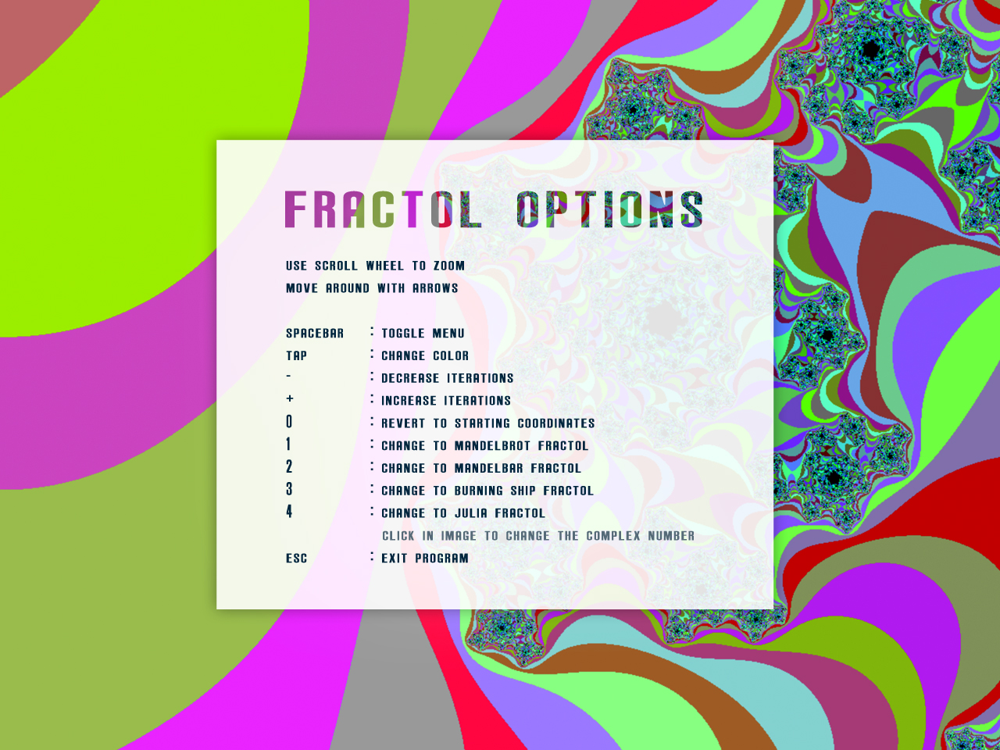
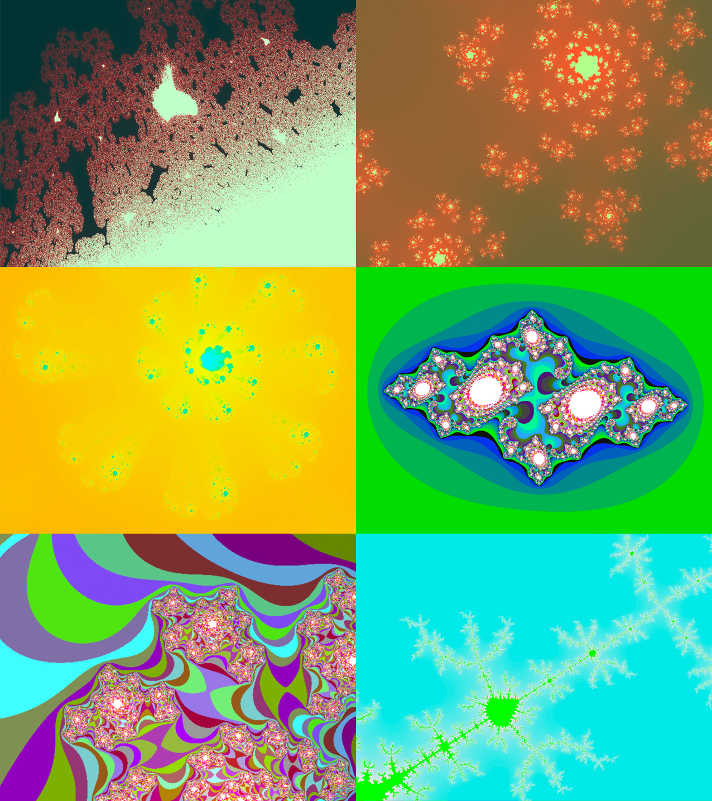

# Fract-ol
A fractal is an abstract mathematical object, like a curve or a surface, which pattern remains the same at every scale. This project is designed to get familiar with the MiniLibX, to discover or use the mathematical notion of complex numbers, to take a peek at the concept of optimization in computer graphics and practice event handling.

### What is Fract-ol?
Pipex is an individual project at [Codam](codam.nl) that requires us to create a program that renders beautiful fractal sets.

#### Objectives
- 2D programming
- Optimization techniques
- Some Maths

#### Skills
- Imperative programming
- Graphics

#### My grade


## Getting started
**Follow the steps below**
```bash
# Clone the project and access the folder
git clone https://github.com/mnweitenberg/codam.git && cd codam/fract-ol/

# Run make in the mlx folder, to make use of the minilibx library
cd mlx & make
cd ../

# Run make so you can build the program with the mandatory part
make

# Run the program with the name of a fractal as argument, for example:
./fractol mandelbrot
./fractol mandelbar
./fractol burning_ship
./fractol julia

# Clean output files with
make fclean

```

## Options
When the program is running there are several options:


#### Some nice stills from my program


---

Made by Milan Weitenberg. [See my LinkedIn.](https://www.linkedin.com/in/mnweitenberg/)
