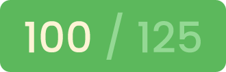

# Inception
This project aims to expand the knowledge of systems administration using [Docker](https://en.wikipedia.org/wiki/Docker_(software)).
You need to virtualize several [Docker images](https://www.techtarget.com/searchitoperations/definition/Docker-image) by creating them in your personal [virtual machine](https://www.vmware.com/topics/glossary/content/virtual-machine.html).

### What is Inception?
Inception is an individual project at [Codam](codam.nl) which requires us to build an infrastructure of services using [Docker](https://docs.docker.com/get-started/overview/), orchestrated by [Docker Compose](https://docs.docker.com/compose/).

In the mandatory part, a container with [nginx](https://www.nginx.com/resources/glossary/nginx/) and only it must be accessible through port 443, exposing the services of the internal [docker network](https://docs.docker.com/network/) for public access. The [nginx](https://www.nginx.com/resources/glossary/nginx/) service connects to the [wordpress](https://en.wikipedia.org/wiki/WordPress) container running [php-fpm](https://www.php.net/manual/en/install.fpm.php) which stores the data in a [mariadb](https://en.wikipedia.org/wiki/MariaDB) service on the network. The [wordpress](https://en.wikipedia.org/wiki/WordPress) and [mariadb](https://en.wikipedia.org/wiki/MariaDB) website data must be persisted each in its own [volume](https://docs.docker.com/storage/volumes/).

#### Skills
- Rigor
- Network & system administration

#### My grade

## Getting started
**Follow the steps below**
### Hardware/Software reccomendations
- create vdi hard disk with 20 GB
- give the VM more memory (4096 MB), more video memory (128 MB) and more CPU-cores (4 cores at maximum of 100%)

### Step by step
- install linux
- username needs to be 'mweitenb'
- install all software updates
- install `git` with `sudo apt install git`
- clone repo 
- run install_requirements.sh
- run `make` in the root of the repository
- go to `https://mweitenb.42.fr` to access the wordpress site
- selfsigned ssl certificate may cause safety warning
- to change the apperance or the contents of the webpage go to `https://mweitenb.42.fr/wp-admin` and use the WP credentials from the .env file
- the server can be shutdowm by running `make clean` in the root of the repo
- you can clean the persistent storage by running `make re` in the root of the repo

---

Milan Weitenberg. [See my LinkedIn.](https://www.linkedin.com/in/mnweitenberg/)