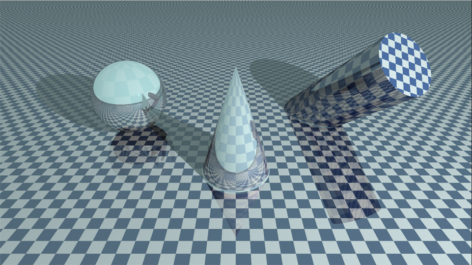
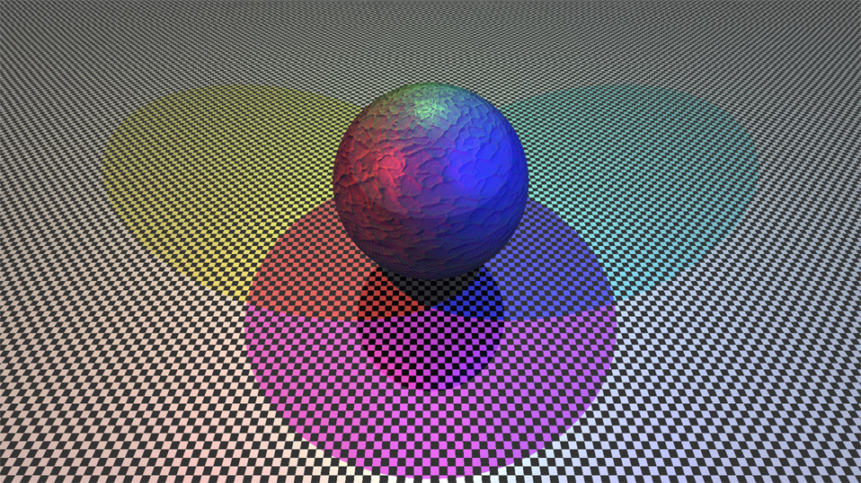
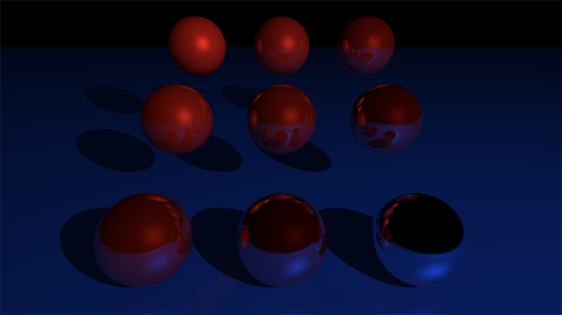
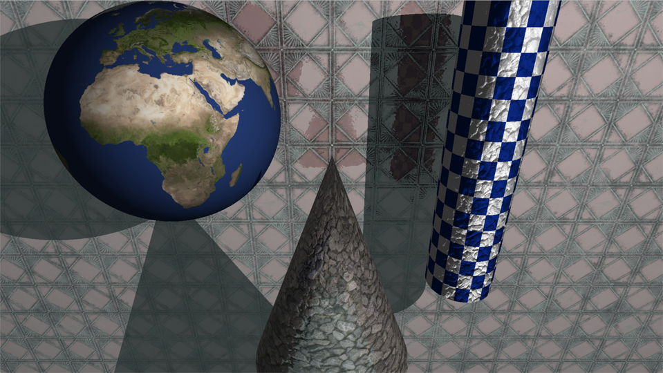

# MiniRT
This is the second graphics project at [Codam](codam.nl), our first RayTracer with miniLibX.

We had to create a raytracer from scratch. The only allowed functions are:
- open, close, read, write, printf, malloc, free, perror, strerror, exit
- all functions of the math library
- all functions of the MinilibX


#### Objectives
- Applicative

#### Skills
- Graphics
- Rigor
- Imperative programming
- Algorithms & AI

#### My grade


## Getting started
**Only works in MacOs or Linux. Follow the steps below**
```bash

# Clone the project and access the folder
git clone https://github.com/mnweitenberg/codam.git && cd codam/mini_rt

# Run make so you can build the program
make

# Run the program with a scene, for example:
./miniRT scenes/reflective.rt

# Follow the instructions on the terminal

# Clean output objects with
make fclean

# Well done!
```

#### Some nice stills from our program






---

Made by:
Jonathan Bedaux. [See my linkedin.](https://www.linkedin.com/in/jonathan-bedaux-62629466/)
Milan Weitenberg. [See my linkedin.](https://www.linkedin.com/in/mnweitenberg/)
